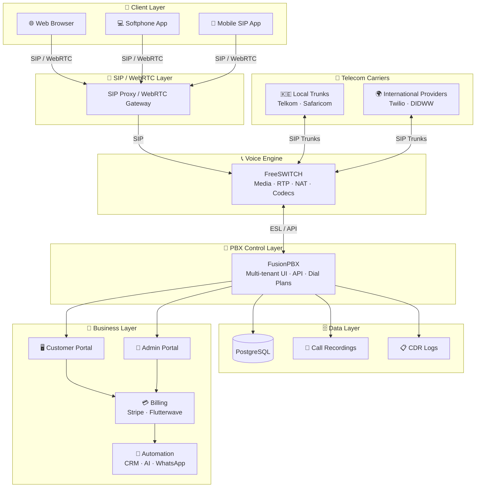

# 📘 WHITE-LABEL PBX (FusionPBX + FreeSWITCH)

**Full Implementation Guide — From Zero to SaaS Launch**

---

## 🧭 1. Architecture Overview

Your system is organised into six layers — from client devices at the top down to your SaaS business layer at the bottom.



---

## 🧰 2. Requirements

### 🖥️ Infrastructure

**Minimum Production Setup (small SaaS start)**

| Role | Count |
|------|-------|
| Application Server (FusionPBX) | 1× |
| Media Server (FreeSWITCH) | 1× |
| Database Server (PostgreSQL) | 1× (can be combined initially) |

**Recommended Cloud Specs**

- CPU: 4–8 cores per server
- RAM: 8–16 GB minimum
- SSD: 100 GB+
- OS: Debian 11/12 or Ubuntu 22.04 LTS

### 🌐 Networking Requirements

- Static public IP (**VERY important**)
- Open ports:
  - SIP: `5060` / `5061`
  - RTP media: `16384–32768` (UDP)
  - Web: `80` / `443`
- Firewall: UFW or iptables
- NAT configuration (critical for audio quality)

### 🔧 Software Stack

**Core**

- FreeSWITCH
- FusionPBX
- PostgreSQL
- Nginx / Apache (FusionPBX web server)

**Supporting tools**

- Fail2Ban (security)
- Certbot (SSL)
- Redis (optional caching layer)
- Kamailio/OpenSIPS (optional scaling later)

**📊 Business Layer (you will add)**

- Billing system (custom or Stripe integration)
- CRM / provisioning tool
- Customer portal (your white-label layer)
- Monitoring (Grafana + Prometheus — optional)

---

## ⚙️ 3. Installation Phase (Step-by-Step)

### 🧱 STEP 1: Prepare Server

```bash
sudo apt update && sudo apt upgrade -y
sudo apt install git curl wget nano unzip -y
```

Set hostname:

```bash
hostnamectl set-hostname pbx.yourdomain.com
```

### 🔐 STEP 2: Firewall Setup

```bash
ufw allow 22
ufw allow 80
ufw allow 443
ufw allow 5060:5061/udp
ufw allow 16384:32768/udp
ufw enable
```

### 📦 STEP 3: Install FreeSWITCH

Install dependencies:

```bash
apt install -y gnupg2 wget lsb-release
```

Install FreeSWITCH (official packages or build from source depending on scale).

> 👉 For production SaaS, building from source is preferred later.

### 🧠 STEP 4: Install FusionPBX

```bash
cd /usr/src
git clone https://github.com/fusionpbx/fusionpbx-install.sh.git
cd fusionpbx-install.sh/debian
./install.sh
```

This installs:

- FreeSWITCH
- FusionPBX
- PostgreSQL
- Web UI
- Default configuration

### 🌐 STEP 5: Configure Domain

Access:

```
https://your-server-ip
```

Then:

1. Create admin account
2. Set domain (your SaaS domain)
3. Enable SSL (Let's Encrypt)

---

## 🏢 4. Multi-Tenant (White Label Core)

> This is the **MOST IMPORTANT PART**.

FusionPBX supports **Domains = Tenants**.

For each customer, create a new domain:

```
client1.yourpbx.com
client2.yourpbx.com
```

Or use a separate SIP realm per tenant:

```
client1-sip.yourdomain.com
```

### 👤 Tenant Isolation Model

Each tenant gets:

- Extensions
- SIP users
- IVR
- Call queues
- Voicemail
- CDR logs

> 👉 Fully isolated inside PostgreSQL schema logic.

---

## 🎨 5. White-Label Branding

Modify the following to rebrand FusionPBX:

- Logo
- Login page CSS
- Footer branding
- System name

**Paths:**

```
/var/www/fusionpbx
```

**Key changes:**

- Replace FusionPBX logo
- Change "FusionPBX" text in templates
- Apply custom CSS theme

**Recommended approach:**

Instead of deep editing, use a reverse proxy (Nginx) to:

- Inject branding layer
- Override UI assets
- Control login screen appearance

---

## 📞 6. SIP & Call Setup

### Configure Trunks

Connect:

- Local carriers in Kenya (Telkom, Safaricom SIP where available)
- International SIP providers (Twilio, DIDWW, etc.)

In FusionPBX: **Accounts → Gateways → Add SIP Trunk**

### RTP Optimization (**VERY IMPORTANT**)

Edit:

```
/etc/freeswitch/autoload_configs/switch.conf.xml
```

Set:

- RTP port range
- NAT settings

---

## 📱 7. Softphone Strategy (Customer Experience)

**Option A: Use existing SIP apps (fastest)**

- Zoiper
- Linphone
- Grandstream Wave

> ✔ No development needed

**Option B: Branded softphone (recommended SaaS path)**

- Build React Native or Flutter app
- Use SIP SDK: PJSIP or Linphone SDK

**Option C: WebRTC browser phone**

- Built into FusionPBX (limited)
- Or custom WebRTC SIP client

---

## 💳 8. Billing System (Critical for SaaS)

FusionPBX does **NOT** provide full billing. You must add your own.

**🔹 Simple start**

- Manual billing per extension

**🔹 SaaS model (recommended)**

Build:

- Customer portal
- Subscription system
- Usage tracking (CDR-based billing)

**Tools:**

- Stripe (global)
- Flutterwave (Africa-friendly)
- Custom PostgreSQL billing tables

---

## 📊 9. Call Data & Analytics

Enable:

- Call Detail Records (CDR)
- Call recording storage
- Real-time monitoring

You will use:

- FusionPBX CDR tables
- FreeSWITCH event socket (advanced analytics)

---

## 🔐 10. Security Hardening

```bash
apt install fail2ban
```

Configure:

- SIP brute-force protection
- IP whitelisting for admin panel
- SSL everywhere
- Disable anonymous SIP

---

## 📈 11. Scaling Strategy (**VERY IMPORTANT** for SaaS)

| Phase | Setup |
|-------|-------|
| Phase 1 | Single FusionPBX + FreeSWITCH server |
| Phase 2 | Separate DB server, PBX controller, and media servers |
| Phase 3 (carrier-grade) | Kamailio SIP proxy, multiple FreeSWITCH nodes, Kubernetes or VM cluster |

---

## 🧩 12. Your White-Label SaaS Layer (What YOU Build)

**Customer Portal**

- Sign up / login
- Buy extensions
- Manage users
- View usage
- Pay bills

**Admin Portal**

- Provision tenants
- Assign SIP trunks
- Monitor usage
- Suspend accounts

**Automation**

- WhatsApp integration
- AI call routing
- Ticket creation from calls/messages

---

## 🚀 13. Deployment Checklist

Before launch:

- [x] SIP trunk tested
- [x] Outbound calls working
- [x] Inbound routing working
- [x] NAT audio OK
- [x] SSL active
- [x] Tenant isolation verified
- [x] Billing tracking working
- [x] Fail2Ban active
- [x] Backups configured

---

## 🧠 14. Common Mistakes to Avoid

- ❌ Editing FreeSWITCH core without backup
- ❌ Ignoring NAT/RTP configuration (causes no-audio issues)
- ❌ Not planning billing early
- ❌ Running single server for too long
- ❌ Exposing FusionPBX admin publicly without IP restriction

---

## 🎯 Final Summary

| Component | Role |
|-----------|------|
| FusionPBX | PBX core + UI |
| FreeSWITCH | Carrier-grade voice engine |
| Your Layer | Branding + billing + customer portal |
| End Result | SaaS PBX provider (3CX alternative) |
