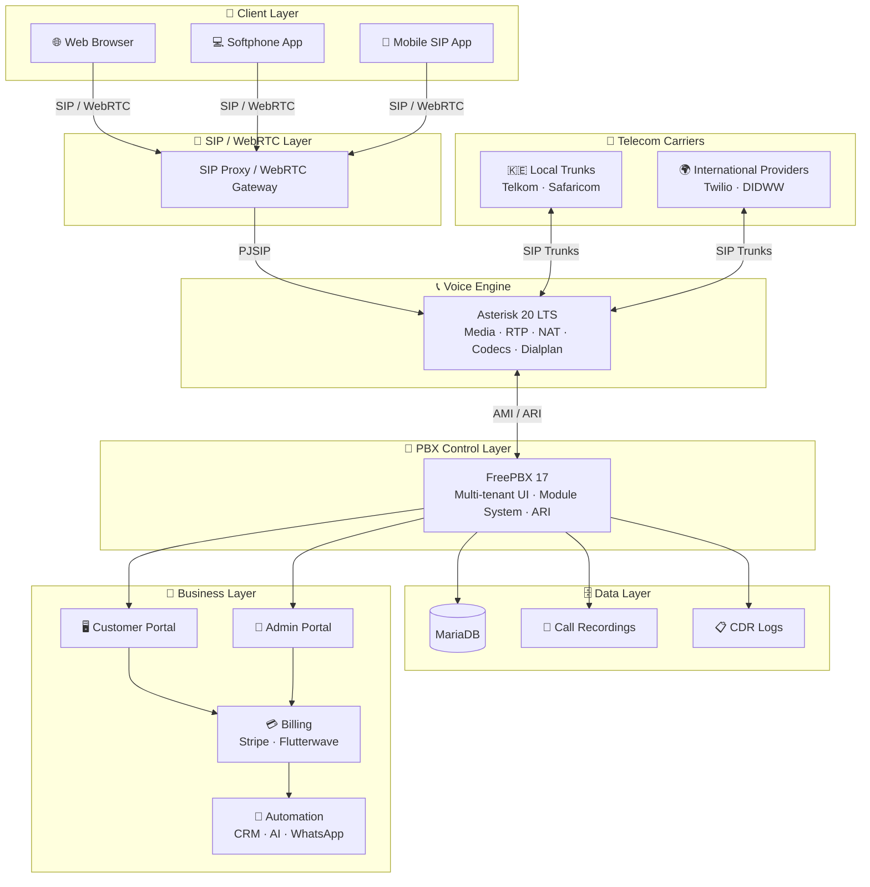

# 📘 WHITE-LABEL PBX (Asterisk + FreePBX)

**Full Implementation Guide — From Zero to SaaS Launch**

> Stack: Asterisk 20 LTS · FreePBX 17 · MariaDB · Debian 12

---

## 🧭 1. Architecture Overview

Your system is organised into six layers — from client devices at the top down to your SaaS business layer at the bottom.



---

## 🧰 2. Requirements

### 🖥️ Infrastructure

**Minimum Production Setup (small SaaS start)**

| Role | Count |
|------|-------|
| Application Server (FreePBX + Asterisk) | 1× |
| Database Server (MariaDB) | 1× (can be combined initially) |

**Recommended Cloud Specs**

- CPU: 4–8 cores per server
- RAM: 8–16 GB minimum
- SSD: 100 GB+
- OS: Debian 12 (Bookworm)

### 🌐 Networking Requirements

- Static public IP (**VERY important**)
- Open ports:
  - SIP: `5060` / `5061`
  - RTP media: `16384–32768` (UDP)
  - Web: `80` / `443`
  - Asterisk ARI: `8088` / `8089` (internal only)
  - Asterisk AMI: `5038` (internal only)
- Firewall: iptables (configured by FreePBX installer)
- NAT configuration (critical for audio quality)

### 🔧 Software Stack

**Core**

- Asterisk 20 LTS
- FreePBX 17
- MariaDB 10.x
- Apache + PHP 8.x

**Supporting tools**

- Fail2Ban (SIP brute-force protection)
- Certbot (SSL via Let's Encrypt)
- Redis (optional session caching)
- Kamailio (optional SIP load balancer — Phase 3)

**📊 Business Layer (you will add)**

- Billing system (custom or Stripe / Flutterwave)
- CRM / provisioning tool
- Customer portal (your white-label layer)
- Monitoring (Grafana + Prometheus — optional)

---

## ⚙️ 3. Installation

### 🧱 STEP 1: Prepare Server (Debian 12)

```bash
apt update && apt upgrade -y
apt install -y git curl wget nano unzip net-tools
hostnamectl set-hostname pbx.yourdomain.com
```

### 🔐 STEP 2: Firewall — open required ports

```bash
apt install -y ufw
ufw default deny incoming
ufw default allow outgoing
ufw allow 22/tcp
ufw allow 80/tcp
ufw allow 443/tcp
ufw allow 5060/udp
ufw allow 5061/udp
ufw allow 5060/tcp
ufw allow 16384:32768/udp
ufw --force enable
```

### 📦 STEP 3: Install Asterisk + FreePBX (official Sangoma installer)

```bash
wget https://github.com/FreePBX/sng_freepbx_debian_install/raw/master/sng_freepbx_debian_install.sh
bash sng_freepbx_debian_install.sh
```

This installs:

- Asterisk 20 LTS (compiled from source)
- FreePBX 17 with all core modules
- MariaDB
- Apache + PHP 8.x
- All system dependencies

> **⚠️ Takes 20–40 minutes. Do not close the terminal.**

### 🌐 STEP 4: First Login

```
http://your-server-ip/admin
```

Complete the FreePBX setup wizard:

1. Set admin username + password
2. Set system hostname
3. Run module updates: **Admin → Module Admin → Check Online**

### 🔒 STEP 5: Enable SSL

```bash
apt install -y certbot python3-certbot-apache
certbot --apache -d pbx.yourdomain.com
```

---

## 🏢 4. Multi-Tenant Design

FreePBX supports two multi-tenant models. Choose based on your scale:

### Model A — Context-Based (recommended for < 50 tenants)

Each tenant gets an isolated Asterisk **context** in the dialplan. Extensions are prefixed or namespaced, and tenants cannot dial across contexts.

```
[tenant-client1]
exten => _1XXX,1,Dial(PJSIP/${EXTEN}@client1)

[tenant-client2]
exten => _2XXX,1,Dial(PJSIP/${EXTEN}@client2)
```

**In FreePBX:** Create a separate **User Context** per tenant under **Admin → User Management**.

**Pros:** Single server, low overhead
**Cons:** Shared Asterisk process — one misconfiguration can affect all tenants

### Model B — Instance-Based (recommended for > 50 tenants or strict isolation)

Each tenant runs their own FreePBX + Asterisk instance (Docker container or separate VM).

```
Tenant A → Docker container → Asterisk instance A → Port 5062
Tenant B → Docker container → Asterisk instance B → Port 5064
```

**Kamailio** routes incoming SIP to the correct instance based on the SIP domain.

**Pros:** Full isolation, independent upgrades
**Cons:** Higher resource usage

### 🗄️ MariaDB Tenant Schema

FreePBX uses the `asterisk` database. Add your own billing database alongside it:

```sql
CREATE DATABASE billing;
USE billing;

CREATE TABLE tenants (
    tenant_id       VARCHAR(36) PRIMARY KEY DEFAULT (UUID()),
    company_name    TEXT NOT NULL,
    email           TEXT NOT NULL,
    sip_context     TEXT NOT NULL,   -- matches Asterisk context
    plan            TEXT DEFAULT 'starter',
    status          TEXT DEFAULT 'active',
    created_at      DATETIME DEFAULT NOW()
);

CREATE TABLE plans (
    plan_id         VARCHAR(36) PRIMARY KEY DEFAULT (UUID()),
    name            TEXT NOT NULL,
    monthly_fee     DECIMAL(10,2) NOT NULL,
    included_minutes INT DEFAULT 0,
    max_extensions  INT DEFAULT 5,
    price_per_min   DECIMAL(8,4) DEFAULT 0.0200
);

CREATE TABLE invoices (
    invoice_id      VARCHAR(36) PRIMARY KEY DEFAULT (UUID()),
    tenant_id       VARCHAR(36),
    period_start    DATE,
    period_end      DATE,
    total           DECIMAL(10,2),
    status          TEXT DEFAULT 'draft',
    stripe_id       TEXT,
    created_at      DATETIME DEFAULT NOW(),
    FOREIGN KEY (tenant_id) REFERENCES tenants(tenant_id)
);
```

### 🔐 Role-Based Access Control (RBAC)

FreePBX ships with built-in user roles. Map them to your SaaS tiers:

| FreePBX Role | Your SaaS Role | Access |
|--------------|----------------|--------|
| Administrator | Platform Admin | Full system |
| SuperAdmin | Reseller | Manage assigned tenants |
| User | Tenant Admin | Own extensions, CDR, voicemail |

---

## 🎨 5. White-Label Branding

### File Locations

```
/var/www/html/admin/                  ← FreePBX admin UI (PHP)
/var/www/html/admin/assets/           ← CSS, images
/etc/freepbx.conf                     ← Core config
```

### Quick Branding Changes

**Replace logo:**

```bash
cp /path/to/your-logo.png /var/www/html/admin/assets/images/logo.png
```

**Change page title and footer** — edit `/var/www/html/admin/views/header.php`:

```php
// Replace:
<title>FreePBX Administration</title>
// With:
<title>MyPBX Administration</title>
```

**Custom CSS** — create `/var/www/html/admin/assets/css/custom.css`:

```css
/* Brand colours */
.navbar { background-color: #0066cc !important; }
.btn-primary { background-color: #0066cc; border-color: #004499; }

/* Hide Sangoma/FreePBX references */
.sangoma-logo, .freepbx-footer { display: none !important; }
```

Add to the header template:

```html
<link rel="stylesheet" href="/admin/assets/css/custom.css">
```

### Nginx Reverse Proxy (Recommended for Production)

Run Nginx in front of Apache to inject branding and control the login screen:

```nginx
server {
    listen 443 ssl http2;
    server_name portal.yourpbx.com;

    ssl_certificate     /etc/letsencrypt/live/portal.yourpbx.com/fullchain.pem;
    ssl_certificate_key /etc/letsencrypt/live/portal.yourpbx.com/privkey.pem;

    sub_filter '</head>'
        '<link rel="stylesheet" href="/custom/brand.css"></head>';
    sub_filter_once on;

    location /custom/ {
        alias /var/www/whitelabel/;
    }

    location / {
        proxy_pass         http://127.0.0.1:80;
        proxy_set_header   Host $host;
        proxy_set_header   X-Real-IP $remote_addr;
        proxy_read_timeout 90;
    }
}
```

---

## 📞 6. SIP Trunk Setup (PJSIP)

> Always use **PJSIP** — legacy `chan_sip` is deprecated in Asterisk 20.

### Add a SIP Trunk in FreePBX

**Connectivity → Trunks → Add Trunk → Add PJSIP Trunk**

| Field | Value |
|-------|-------|
| Trunk Name | `twilio` |
| Username | your account SID |
| Secret | your auth token |
| SIP Server | `your-account.pstn.twilio.com` |
| Context | `from-trunk` |

### NAT Configuration (VERY IMPORTANT)

In FreePBX: **Admin → Asterisk SIP Settings**

| Setting | Value |
|---------|-------|
| External IP | `your-public-ip` |
| Local Networks | `192.168.0.0/16`, `10.0.0.0/8` |
| NAT | `yes` |
| RTP Port Range | `16384–32768` |

This writes to `/etc/asterisk/pjsip.conf` automatically.

> **⚠️ Production pitfall:** One-way audio is almost always a NAT misconfiguration. Always test from an external network, not the same LAN as the server.

---

## 📱 7. Softphone Strategy

**Option A: Use existing SIP apps (fastest)**

- Zoiper (Android / iOS / Desktop)
- Linphone
- Grandstream Wave

> ✔ No development needed — hand SIP credentials to customers

**Option B: Branded softphone**

- React Native or Flutter app
- SIP SDK: PJSIP or Linphone SDK

**Option C: WebRTC browser phone**

- FreePBX includes UCP (User Control Panel) with WebRTC phone
- Or build a custom WebRTC client using JsSIP + Asterisk `res_http_websocket`

**Provisioning flow:**

```
Customer signs up
    → Portal creates FreePBX extension via ARI/admin API
    → Generates SIP credentials
    → Sends welcome email with QR code
    → Customer scans in Zoiper → Connected
```

---

## 💳 8. Billing System

### Asterisk CDR Table (MariaDB)

Asterisk writes all call records to `asteriskcdrdb.cdr`:

```sql
USE asteriskcdrdb;
DESCRIBE cdr;
-- Key columns:
-- calldate    DATETIME      -- call start time
-- src         VARCHAR(80)   -- caller number
-- dst         VARCHAR(80)   -- destination
-- duration    INT           -- total duration (seconds)
-- billsec     INT           -- billable seconds (after answer)
-- disposition VARCHAR(45)   -- ANSWERED, NO ANSWER, BUSY, FAILED
-- accountcode VARCHAR(20)   -- set this to tenant_id for billing
-- uniqueid    VARCHAR(32)   -- unique call ID
```

**Set accountcode per tenant in Asterisk dialplan:**

```
; /etc/asterisk/extensions_custom.conf
[tenant-client1]
exten => _.,1,Set(CDR(accountcode)=tenant-client1-uuid)
 same => n,Goto(from-internal,${EXTEN},1)
```

### CDR Billing Worker (Python)

```python
import mysql.connector, time

ASTERISK_DB = dict(host="localhost", database="asteriskcdrdb",
                   user="asterisk", password="secret")
BILLING_DB  = dict(host="localhost", database="billing",
                   user="billing",  password="secret")

RATE_PER_MIN = 0.02

def process_cdrs():
    ast = mysql.connector.connect(**ASTERISK_DB)
    bil = mysql.connector.connect(**BILLING_DB)

    ast_cur = ast.cursor(dictionary=True)
    ast_cur.execute("""
        SELECT uniqueid, accountcode, src, dst, calldate, billsec
        FROM cdr
        WHERE calldate > NOW() - INTERVAL 2 MINUTE
          AND billsec > 0
          AND disposition = 'ANSWERED'
    """)

    bil_cur = bil.cursor()
    for row in ast_cur.fetchall():
        cost = round((row['billsec'] / 60) * RATE_PER_MIN, 4)
        bil_cur.execute("""
            INSERT IGNORE INTO call_records
                (call_uuid, tenant_id, caller, destination,
                 start_time, billable_sec, cost)
            SELECT %s, tenant_id, %s, %s, %s, %s, %s
            FROM tenants WHERE sip_context = %s
        """, (row['uniqueid'], row['src'], row['dst'],
              row['calldate'], row['billsec'], cost, row['accountcode']))
    bil.commit()
    ast_cur.close(); bil_cur.close()
    ast.close(); bil.close()

while True:
    process_cdrs()
    time.sleep(60)
```

### Stripe Integration

```python
import stripe
stripe.api_key = "sk_live_..."

def create_invoice(tenant, period_start, period_end, total_usd):
    inv = stripe.Invoice.create(
        customer=tenant['stripe_customer_id'],
        auto_advance=True,
        collection_method="charge_automatically",
    )
    stripe.InvoiceItem.create(
        customer=tenant['stripe_customer_id'],
        invoice=inv['id'],
        amount=int(total_usd * 100),
        currency="usd",
        description=f"PBX Service {period_start} – {period_end}"
    )
    stripe.Invoice.finalize_invoice(inv['id'])
    return inv['id']
```

### Flutterwave (Kenya / Africa — KES)

```python
import requests

def charge_mpesa(phone: str, amount_kes: float, ref: str):
    resp = requests.post(
        "https://api.flutterwave.com/v3/charges?type=mobile_money_kenya",
        headers={"Authorization": "Bearer FLWSECK_LIVE-..."},
        json={
            "phone_number": phone,
            "amount": amount_kes,
            "currency": "KES",
            "tx_ref": ref,
            "network": "SAFARICOM"
        }
    )
    return resp.json()
```

---

## 🖥️ 9. Customer Portal Architecture

### Recommended Stack

| Layer | Choice |
|-------|--------|
| Frontend | Next.js (React) |
| Backend API | FastAPI (Python) or Node.js |
| Auth | JWT + refresh tokens |
| Database | MariaDB (billing DB above) |
| Asterisk integration | ARI (REST) + AMI (events) |

### Core API Endpoints

```
POST   /auth/login                  → JWT token
GET    /dashboard                   → usage summary, active calls
GET    /extensions                  → list extensions
POST   /extensions                  → provision new extension
DELETE /extensions/:id              → remove extension
GET    /cdr?from=&to=               → call history
GET    /invoices                    → invoice list
GET    /invoices/:id/pdf            → download invoice
POST   /billing/payment-method      → attach Stripe card
GET    /sip-credentials/:ext_id     → SIP username/password
POST   /support/ticket              → open support ticket
```

### Provision Extension via Asterisk ARI

```python
import requests

ARI_URL = "http://localhost:8088/ari"
ARI_AUTH = ("asterisk_user", "asterisk_password")

def provision_extension(ext_num: str, password: str, tenant_context: str):
    # FreePBX REST API — alternative to ARI for module-level provisioning
    import subprocess
    subprocess.run([
        "php", "/var/www/html/admin/modules/core/api.php",
        "add_extension",
        f"--ext={ext_num}",
        f"--password={password}",
        f"--context={tenant_context}"
    ])
```

---

## 📊 10. Real-Time Call Monitoring (AMI)

Asterisk Manager Interface (AMI) is the equivalent of FreeSWITCH ESL — use it for real-time events, live dashboards, and automation triggers.

```python
import socket, time

def ami_connect(host="127.0.0.1", port=5038,
                user="admin", secret="your_ami_secret"):
    sock = socket.socket(socket.AF_INET, socket.SOCK_STREAM)
    sock.connect((host, port))
    sock.recv(1024)  # banner
    sock.send(f"Action: Login\r\nUsername: {user}\r\nSecret: {secret}\r\n\r\n".encode())
    sock.recv(1024)  # response
    sock.send(b"Action: Events\r\nEventMask: call\r\n\r\n")
    return sock

def listen_events(sock):
    buf = ""
    while True:
        buf += sock.recv(4096).decode(errors="ignore")
        while "\r\n\r\n" in buf:
            event_str, buf = buf.split("\r\n\r\n", 1)
            event = dict(line.split(": ", 1) for line in
                         event_str.splitlines() if ": " in line)
            yield event

sock = ami_connect()
for event in listen_events(sock):
    if event.get("Event") == "Hangup":
        print(f"Call ended: {event.get('CallerIDNum')} → {event.get('Exten')} "
              f"cause={event.get('Cause-txt')}")
```

**Enable AMI** in `/etc/asterisk/manager.conf`:

```ini
[general]
enabled = yes
port = 5038
bindaddr = 127.0.0.1   ; NEVER expose to public internet

[admin]
secret = your_ami_secret
read = all
write = all
```

---

## 🔐 11. Security Hardening

### Fail2Ban — Asterisk SIP Protection

```bash
apt install -y fail2ban
```

Create `/etc/fail2ban/jail.d/asterisk.conf`:

```ini
[asterisk]
enabled  = true
filter   = asterisk
logpath  = /var/log/asterisk/full
maxretry = 5
findtime = 60
bantime  = 3600
```

Create `/etc/fail2ban/filter.d/asterisk.conf`:

```ini
[Definition]
failregex = (?:NOTICE|WARNING).* (?:Registration|Auth)\s.*from\s.*<HOST>
            (?:NOTICE|WARNING).* (?:failed|invalid|wrong)\s.*\s<HOST>
ignoreregex =
```

```bash
systemctl restart fail2ban
fail2ban-client status asterisk
```

### Anti-Fraud Rules

**1. Disable unauthenticated SIP** in `/etc/asterisk/pjsip.conf`:

```ini
[global]
type = global
default_outbound_endpoint = default
```

Ensure all endpoints require `auth` sections — FreePBX does this by default.

**2. Block international calls by default per tenant:**

```
; extensions_custom.conf
[tenant-client1]
exten => _00.,1,Hangup(21)   ; block international unless explicitly allowed
```

**3. Concurrent call limits per extension:**

```
exten => _.,1,Set(GROUP()=tenant-client1)
 same => n,GotoIf($[${GROUP_COUNT(tenant-client1)} > 10]?toolimit)
 same => n,Dial(...)
 same => n(toolimit),Hangup(17)
```

**4. IP-restrict the FreePBX admin panel:**

```apache
# /etc/apache2/conf.d/freepbx_security.conf
<Location /admin>
    Order deny,allow
    Deny from all
    Allow from 196.216.0.0/16   # your office IP
</Location>
```

### Backup & Disaster Recovery

```bash
# Full FreePBX backup (includes Asterisk config + DB)
fwconsole backup --id=1   # run configured backup job

# Manual MariaDB backup
mysqldump asterisk asteriskcdrdb billing | gzip \
  > /backups/pbx_$(date +%F).sql.gz

# Sync to S3-compatible storage
aws s3 sync /backups/ s3://your-pbx-backups/ --delete
```

---

## 📈 12. Scaling Strategy

| Phase | Setup |
|-------|-------|
| Phase 1 | Single Asterisk + FreePBX server |
| Phase 2 | Separate DB server, dedicated media server |
| Phase 3 (carrier-grade) | Kamailio SIP proxy, multiple Asterisk nodes, DB cluster |

### Phase 3 — Kamailio in Front of Multiple Asterisk Nodes

```
SIP Clients
    ↓
Kamailio (dispatcher — round robin)
    ↓              ↓
Asterisk-1     Asterisk-2
```

```
# kamailio.cfg dispatcher block
loadmodule "dispatcher.so"
modparam("dispatcher", "ds_ping_interval", 10)

route[DISPATCH] {
    if (!ds_select_dst("1", "4")) {
        sl_send_reply("503", "Unavailable");
        exit;
    }
    t_relay();
}
```

```sql
INSERT INTO dispatcher (setid, destination)
VALUES (1, 'sip:192.168.1.10:5060'),
       (1, 'sip:192.168.1.11:5060');
```

---

## 🤖 13. Automation & AI Integration

### Missed Call → ERPNext Ticket (via AMI)

```python
import socket, requests

AMI_HOST, AMI_PORT = "127.0.0.1", 5038
ERPNEXT = "https://erp.yourcompany.com"
ERP_KEY  = "token api_key:api_secret"

sock = ami_connect()
for event in listen_events(sock):
    if (event.get("Event") == "Hangup"
            and event.get("Cause-txt") == "Normal Clearing"
            and event.get("Duration", "0") == "0"):
        requests.post(f"{ERPNEXT}/api/resource/Issue",
            headers={"Authorization": ERP_KEY},
            json={
                "subject": f"Missed call from {event.get('CallerIDNum')}",
                "description": f"Dialled: {event.get('Exten')}\n"
                               f"Tenant: {event.get('Accountcode')}",
                "status": "Open"
            }
        )
```

### AI Call Routing via ARI (Asterisk REST Interface)

```python
import anthropic, requests

ARI  = "http://localhost:8088/ari"
AUTH = ("asterisk_user", "password")
ai   = anthropic.Anthropic()

def classify_intent(transcript: str) -> str:
    msg = ai.messages.create(
        model="claude-sonnet-4-6",
        max_tokens=32,
        messages=[{"role": "user", "content":
            f"Classify into one word — sales|support|billing|other\n\n{transcript}"
        }]
    )
    return msg.content[0].text.strip().lower()

def route_call(channel_id: str, transcript: str):
    intent = classify_intent(transcript)
    queue  = {
        "sales":   "sales-queue",
        "support": "support-queue",
        "billing": "billing-queue",
        "other":   "general-queue"
    }.get(intent, "general-queue")

    requests.post(f"{ARI}/channels/{channel_id}/continue",
        auth=AUTH,
        json={"context": "from-internal",
              "extension": queue,
              "priority": 1}
    )
```

### WhatsApp Missed Call Alert (Twilio)

```python
from twilio.rest import Client

twilio = Client("ACxxxxx", "auth_token")

def whatsapp_alert(to: str, caller: str, ext: str):
    twilio.messages.create(
        from_="whatsapp:+14155238886",
        to=f"whatsapp:{to}",
        body=f"📞 Missed call from {caller} to extension {ext}. Reply to call back."
    )
```

---

## 🚀 14. Deployment Checklist

- [x] Server provisioned (Debian 12)
- [x] Firewall configured
- [x] Asterisk + FreePBX installed
- [ ] SSL certificate active
- [ ] SIP trunk connected and tested
- [ ] Outbound calls working
- [ ] Inbound routing working
- [ ] NAT / one-way audio verified from external network
- [ ] Tenant isolation verified
- [ ] Fail2Ban active
- [ ] Admin panel IP-restricted
- [ ] Toll fraud limits set (concurrent call caps)
- [ ] CDR billing worker running
- [ ] Customer portal deployed
- [ ] Stripe / Flutterwave connected
- [ ] Backups configured and tested

---

## 🧠 15. Common Mistakes to Avoid

- ❌ Using legacy `chan_sip` — always use PJSIP in Asterisk 20
- ❌ Ignoring NAT/RTP config — #1 cause of one-way audio
- ❌ Exposing AMI (port 5038) to the public internet
- ❌ Exposing ARI (port 8088) to the public internet
- ❌ Not setting `accountcode` in dialplan — breaks CDR-based billing
- ❌ Skipping toll fraud limits — one compromised extension can cost thousands
- ❌ Running FreePBX admin panel without IP restriction
- ❌ Forgetting to test audio from an external mobile network before go-live
- ❌ Not backing up before FreePBX module updates

---

## 🎯 Final Summary

| Component | Role |
|-----------|------|
| Asterisk 20 LTS | Carrier-grade call engine + dialplan |
| FreePBX 17 | Multi-tenant web UI + module system |
| MariaDB | All PBX config + CDR + billing data |
| Apache + PHP | FreePBX web server |
| Nginx (proxy) | White-label branding layer |
| AMI | Real-time call events for automation |
| ARI | REST API for AI routing + programmatic control |
| Kamailio | SIP load balancer (Phase 3) |
| Fail2Ban + ACLs | Security + fraud prevention |
| Your Portal | Branding + billing + customer self-service |
| End Result | SaaS PBX provider (3CX alternative) |
